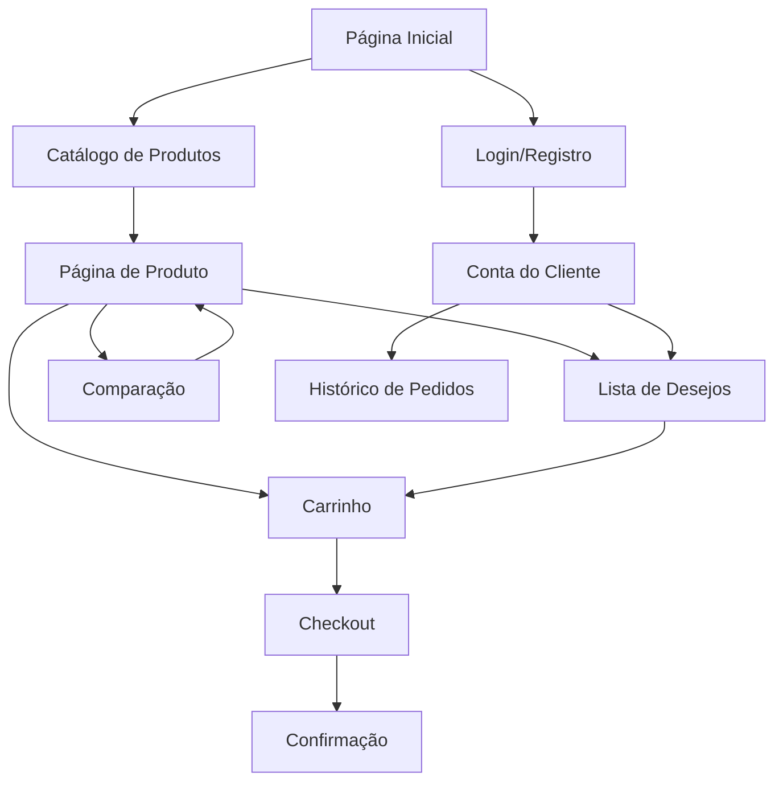

# Documento de Requisitos do Produto - E-commerce de Óculos Ótica Isis

## 1. Visão Geral do Produto

Um e-commerce moderno e responsivo da Ótica Isis, especializado na venda de produtos ópticos, incluindo óculos de grau, óculos de sol, lentes de contato e acessórios ópticos. <mcreference link="https://workdo.io/glasses-shopify-theme/" index="1">1</mcreference>

A plataforma oferece uma experiência de compra premium com visualização avançada de produtos, personalização e ferramentas de comparação para atender clientes que buscam qualidade e estilo em produtos ópticos. <mcreference link="https://themeforest.net/item/specs-glasses-store-ecommerce-shopify-os-20/54408725" index="2">2</mcreference>

O objetivo é criar uma presença online forte para a Ótica Isis no mercado competitivo de produtos ópticos, atraindo consumidores conscientes da moda que valorizam qualidade e estilo.

## 2. Funcionalidades Principais

### 2.1 Papéis de Usuário

| Papel | Método de Registro | Permissões Principais |
|-------|-------------------|----------------------|
| Visitante | Navegação livre | Visualizar produtos, adicionar ao carrinho como convidado |
| Cliente Registrado | Email + senha | Conta pessoal, histórico de pedidos, lista de desejos, avaliações |
| Administrador | Acesso backend | Gerenciar produtos, pedidos, clientes, relatórios, configurações |

### 2.2 Módulos de Funcionalidades

Nosso e-commerce da Ótica Isis consiste nas seguintes páginas principais:

1. **Página Inicial**: seção hero com produtos em destaque, navegação principal, categorias de produtos, depoimentos de clientes
2. **Catálogo de Produtos**: listagem de produtos com filtros avançados, ordenação, visualização em grade/lista
3. **Página de Produto**: detalhes do produto, galeria de imagens, opções de personalização, avaliações, produtos relacionados
4. **Carrinho de Compras**: resumo de itens, cálculo de frete, cupons de desconto, checkout rápido
5. **Checkout**: informações de entrega, pagamento, confirmação do pedido
6. **Conta do Cliente**: perfil, histórico de pedidos, lista de desejos, endereços salvos
7. **Página de Login/Registro**: autenticação de usuários, recuperação de senha
8. **Página de Comparação**: comparar até 4 produtos lado a lado
9. **Lista de Desejos**: produtos salvos para compra futura
10. **Página de Contato**: formulário de contato, informações da loja, mapa

### 2.3 Detalhes das Páginas

| Nome da Página | Nome do Módulo | Descrição da Funcionalidade |
|----------------|----------------|-----------------------------|
| Página Inicial | Seção Hero | Banner rotativo com produtos em destaque, call-to-action, navegação visual |
| Página Inicial | Categorias de Produtos | Grid de categorias (óculos de grau, sol, lentes), imagens atrativas, links diretos |
| Página Inicial | Produtos em Destaque | Carrossel de produtos populares, preços, botão de compra rápida |
| Página Inicial | Newsletter | Popup de inscrição, desconto para novos assinantes, integração com email marketing |
| Catálogo | Sistema de Filtros | Filtrar por marca, preço, cor, formato, material, gênero, tipo de lente |
| Catálogo | Ordenação | Ordenar por preço, popularidade, novidades, avaliações, desconto |
| Catálogo | Visualização Rápida | Modal com detalhes básicos, imagens, adicionar ao carrinho sem sair da página |
| Produto | Galeria de Imagens | Zoom, visualização 360°, múltiplas cores, try-on virtual (se aplicável) |
| Produto | Informações Detalhadas | Especificações técnicas, materiais, dimensões, instruções de cuidado |
| Produto | Sistema de Avaliações | Estrelas, comentários, fotos de clientes, filtros de avaliação |
| Produto | Produtos Relacionados | Sugestões baseadas em categoria, preço similar, frequentemente comprados juntos |
| Carrinho | Resumo de Itens | Lista de produtos, quantidades, preços, opção de remover/editar |
| Carrinho | Cálculo de Frete | CEP, opções de entrega, prazos, valores, frete grátis acima de valor |
| Carrinho | Cupons de Desconto | Campo para código promocional, validação, aplicação automática |
| Checkout | Informações de Entrega | Formulário de endereço, múltiplos endereços, validação de CEP |
| Checkout | Opções de Pagamento | Cartão, PIX, boleto, parcelamento, gateway seguro, validação |
| Conta | Perfil do Cliente | Dados pessoais, preferências, histórico de navegação, edição de informações |
| Conta | Histórico de Pedidos | Lista de compras, status, rastreamento, recompra, avaliações pendentes |
| Conta | Lista de Desejos | Produtos salvos, notificação de desconto, mover para carrinho |
| Comparação | Tabela Comparativa | Até 4 produtos, especificações lado a lado, destacar diferenças |
| Login/Registro | Autenticação | Login social, validação de email, recuperação de senha, criação de conta |
| Contato | Formulário | Campos de contato, categorias de assunto, validação, resposta automática |

## 3. Processo Principal

### Fluxo do Cliente Regular:
1. Visitante acessa a página inicial
2. Navega pelas categorias ou usa a busca
3. Visualiza produtos no catálogo com filtros
4. Acessa página de produto para detalhes
5. Adiciona produto ao carrinho ou lista de desejos
6. Revisa carrinho e aplica cupons
7. Realiza checkout com dados de entrega e pagamento
8. Recebe confirmação e acompanha pedido

### Fluxo do Administrador:
1. Acessa painel administrativo
2. Gerencia catálogo de produtos (adicionar/editar/remover)
3. Processa pedidos e atualiza status
4. Monitora estoque e relatórios de vendas
5. Configura promoções e cupons
6. Gerencia conteúdo do site

## 4. Design da Interface do Usuário

### 4.1 Estilo de Design

- **Cores Primárias**: Azul escuro (#1a365d) e branco (#ffffff) para transmitir confiança e profissionalismo
- **Cores Secundárias**: Cinza claro (#f7fafc) para backgrounds, laranja (#ed8936) para call-to-actions
- **Estilo de Botões**: Bordas arredondadas (8px), efeito hover suave, sombras sutis
- **Tipografia**: Fonte principal Inter ou similar, tamanhos 14px-18px para texto, 24px-48px para títulos
- **Layout**: Design baseado em cards, navegação superior fixa, sidebar para filtros
- **Ícones**: Estilo minimalista, linha fina, conjunto consistente (Feather Icons ou similar)

### 4.2 Visão Geral do Design das Páginas

| Nome da Página | Nome do Módulo | Elementos de UI |
|----------------|----------------|----------------|
| Página Inicial | Seção Hero | Banner full-width, overlay escuro, texto branco, botão CTA laranja, animação suave |
| Página Inicial | Grid de Categorias | Cards 3x2, imagens de alta qualidade, hover com zoom, títulos em fonte bold |
| Catálogo | Filtros Laterais | Sidebar fixa, checkboxes customizados, sliders de preço, botão "Limpar Filtros" |
| Catálogo | Grid de Produtos | Layout responsivo 4-3-2-1 colunas, cards com sombra, badges de desconto |
| Produto | Galeria Principal | Imagem grande à esquerda, thumbnails abaixo, zoom on hover, indicadores de cor |
| Produto | Informações | Título h1, preço destacado, botões de ação primários, tabs para especificações |
| Carrinho | Lista de Itens | Tabela responsiva, imagens pequenas, controles de quantidade, totais destacados |
| Checkout | Formulário | Steps visuais, validação em tempo real, campos obrigatórios marcados |

### 4.3 Responsividade

Design mobile-first com adaptação para desktop, otimização para touch em dispositivos móveis, breakpoints em 768px, 1024px e 1200px. <mcreference link="https://workdo.io/glasses-shopify-theme/" index="1">1</mcreference> Carregamento lazy de imagens e otimização de performance para garantir experiência fluida em todos os dispositivos. <mcreference link="https://themeforest.net/item/specs-glasses-store-ecommerce-shopify-os-20/54408725" index="2">2</mcreference>