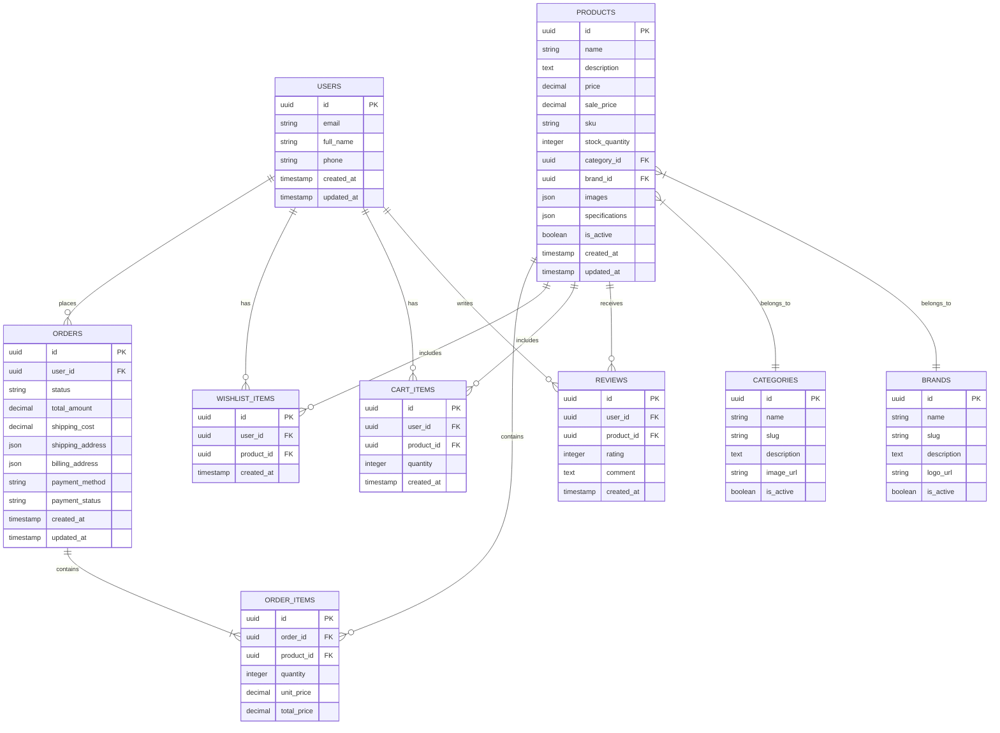

# Documento de Arquitetura Técnica - E-commerce de Óculos Ótica Isis

## 1. Design da Arquitetura


## 2. Descrição das Tecnologias

- **Frontend**: React@18 + TypeScript + Tailwind CSS@3 + Vite
- **Backend**: Supabase (PostgreSQL + Auth + Storage)
- **Estado Global**: Zustand ou Context API
- **Roteamento**: React Router DOM@6
- **Formulários**: React Hook Form + Zod
- **UI Components**: Headless UI + Radix UI
- **Ícones**: Lucide React
- **Animações**: Framer Motion

## 3. Definições de Rotas

| Rota | Propósito |
|------|----------|
| / | Página inicial com produtos em destaque e categorias |
| /produtos | Catálogo de produtos com filtros e busca |
| /produtos/:categoria | Produtos filtrados por categoria (oculos-grau, oculos-sol, lentes) |
| /produto/:id | Página de detalhes do produto individual |
| /carrinho | Carrinho de compras com resumo e cálculo de frete |
| /checkout | Processo de finalização da compra |
| /login | Página de autenticação do usuário |
| /registro | Página de criação de nova conta |
| /conta | Dashboard da conta do cliente |
| /conta/pedidos | Histórico de pedidos do cliente |
| /conta/lista-desejos | Lista de produtos salvos |
| /conta/perfil | Edição de dados pessoais |
| /comparar | Página de comparação de produtos |
| /contato | Formulário de contato e informações da loja |
| /sobre | Informações sobre a empresa |
| /politica-privacidade | Termos de uso e política de privacidade |

## 4. Definições de API

### 4.1 APIs Principais

**Autenticação de usuários**
```
POST /auth/v1/signup
```

Request:
| Nome do Parâmetro | Tipo | Obrigatório | Descrição |
|-------------------|------|-------------|----------|
| email | string | true | Email do usuário |
| password | string | true | Senha (mínimo 6 caracteres) |
| full_name | string | true | Nome completo |

Response:
| Nome do Parâmetro | Tipo | Descrição |
|-------------------|------|----------|
| user | object | Dados do usuário criado |
| session | object | Token de sessão |

**Busca de produtos**
```
GET /rest/v1/products
```

Request:
| Nome do Parâmetro | Tipo | Obrigatório | Descrição |
|-------------------|------|-------------|----------|
| category | string | false | Filtro por categoria |
| brand | string | false | Filtro por marca |
| min_price | number | false | Preço mínimo |
| max_price | number | false | Preço máximo |
| search | string | false | Termo de busca |
| limit | number | false | Limite de resultados (padrão: 20) |
| offset | number | false | Offset para paginação |

Response:
| Nome do Parâmetro | Tipo | Descrição |
|-------------------|------|----------|
| data | array | Lista de produtos |
| count | number | Total de produtos encontrados |

**Criação de pedido**
```
POST /rest/v1/orders
```

Request:
| Nome do Parâmetro | Tipo | Obrigatório | Descrição |
|-------------------|------|-------------|----------|
| items | array | true | Lista de itens do pedido |
| shipping_address | object | true | Endereço de entrega |
| payment_method | string | true | Método de pagamento |
| total_amount | number | true | Valor total do pedido |

Response:
| Nome do Parâmetro | Tipo | Descrição |
|-------------------|------|----------|
| order_id | string | ID único do pedido |
| status | string | Status do pedido |
| payment_url | string | URL para pagamento (se aplicável) |

Exemplo:
```json
{
  "items": [
    {
      "product_id": "123",
      "quantity": 1,
      "price": 299.90
    }
  ],
  "shipping_address": {
    "street": "Rua das Flores, 123",
    "city": "São Paulo",
    "state": "SP",
    "zip_code": "01234-567"
  },
  "payment_method": "credit_card",
  "total_amount": 329.90
}
```

## 5. Modelo de Dados

### 5.1 Definição do Modelo de Dados



### 5.2 Linguagem de Definição de Dados

**Tabela de Usuários (users)**
```sql
-- Criar tabela
CREATE TABLE users (
    id UUID PRIMARY KEY DEFAULT gen_random_uuid(),
    email VARCHAR(255) UNIQUE NOT NULL,
    full_name VARCHAR(100) NOT NULL,
    phone VARCHAR(20),
    created_at TIMESTAMP WITH TIME ZONE DEFAULT NOW(),
    updated_at TIMESTAMP WITH TIME ZONE DEFAULT NOW()
);

-- Criar índices
CREATE INDEX idx_users_email ON users(email);

-- Permissões RLS
ALTER TABLE users ENABLE ROW LEVEL SECURITY;
CREATE POLICY "Users can view own profile" ON users FOR SELECT USING (auth.uid() = id);
CREATE POLICY "Users can update own profile" ON users FOR UPDATE USING (auth.uid() = id);

-- Permissões básicas
GRANT SELECT ON users TO anon;
GRANT ALL PRIVILEGES ON users TO authenticated;
```

**Tabela de Categorias (categories)**
```sql
-- Criar tabela
CREATE TABLE categories (
    id UUID PRIMARY KEY DEFAULT gen_random_uuid(),
    name VARCHAR(100) NOT NULL,
    slug VARCHAR(100) UNIQUE NOT NULL,
    description TEXT,
    image_url VARCHAR(500),
    is_active BOOLEAN DEFAULT true,
    created_at TIMESTAMP WITH TIME ZONE DEFAULT NOW()
);

-- Criar índices
CREATE INDEX idx_categories_slug ON categories(slug);
CREATE INDEX idx_categories_active ON categories(is_active);

-- Dados iniciais
INSERT INTO categories (name, slug, description) VALUES
('Óculos de Grau', 'oculos-grau', 'Óculos para correção visual'),
('Óculos de Sol', 'oculos-sol', 'Óculos para proteção solar'),
('Lentes de Contato', 'lentes-contato', 'Lentes de contato diversas');

-- Permissões
GRANT SELECT ON categories TO anon;
GRANT ALL PRIVILEGES ON categories TO authenticated;
```

**Tabela de Marcas (brands)**
```sql
-- Criar tabela
CREATE TABLE brands (
    id UUID PRIMARY KEY DEFAULT gen_random_uuid(),
    name VARCHAR(100) NOT NULL,
    slug VARCHAR(100) UNIQUE NOT NULL,
    description TEXT,
    logo_url VARCHAR(500),
    is_active BOOLEAN DEFAULT true,
    created_at TIMESTAMP WITH TIME ZONE DEFAULT NOW()
);

-- Criar índices
CREATE INDEX idx_brands_slug ON brands(slug);
CREATE INDEX idx_brands_active ON brands(is_active);

-- Dados iniciais
INSERT INTO brands (name, slug, description) VALUES
('Ray-Ban', 'ray-ban', 'Marca icônica de óculos'),
('Oakley', 'oakley', 'Óculos esportivos de alta performance'),
('Prada', 'prada', 'Óculos de luxo e moda');

-- Permissões
GRANT SELECT ON brands TO anon;
GRANT ALL PRIVILEGES ON brands TO authenticated;
```

**Tabela de Produtos (products)**
```sql
-- Criar tabela
CREATE TABLE products (
    id UUID PRIMARY KEY DEFAULT gen_random_uuid(),
    name VARCHAR(200) NOT NULL,
    description TEXT,
    price DECIMAL(10,2) NOT NULL,
    sale_price DECIMAL(10,2),
    sku VARCHAR(50) UNIQUE NOT NULL,
    stock_quantity INTEGER DEFAULT 0,
    category_id UUID REFERENCES categories(id),
    brand_id UUID REFERENCES brands(id),
    images JSONB DEFAULT '[]',
    specifications JSONB DEFAULT '{}',
    is_active BOOLEAN DEFAULT true,
    created_at TIMESTAMP WITH TIME ZONE DEFAULT NOW(),
    updated_at TIMESTAMP WITH TIME ZONE DEFAULT NOW()
);

-- Criar índices
CREATE INDEX idx_products_category ON products(category_id);
CREATE INDEX idx_products_brand ON products(brand_id);
CREATE INDEX idx_products_price ON products(price);
CREATE INDEX idx_products_active ON products(is_active);
CREATE INDEX idx_products_stock ON products(stock_quantity);
CREATE INDEX idx_products_name_search ON products USING gin(to_tsvector('portuguese', name));

-- Permissões
GRANT SELECT ON products TO anon;
GRANT ALL PRIVILEGES ON products TO authenticated;
```

**Tabela de Pedidos (orders)**
```sql
-- Criar tabela
CREATE TABLE orders (
    id UUID PRIMARY KEY DEFAULT gen_random_uuid(),
    user_id UUID REFERENCES users(id),
    status VARCHAR(20) DEFAULT 'pending' CHECK (status IN ('pending', 'confirmed', 'processing', 'shipped', 'delivered', 'cancelled')),
    total_amount DECIMAL(10,2) NOT NULL,
    shipping_cost DECIMAL(10,2) DEFAULT 0,
    shipping_address JSONB NOT NULL,
    billing_address JSONB,
    payment_method VARCHAR(50) NOT NULL,
    payment_status VARCHAR(20) DEFAULT 'pending' CHECK (payment_status IN ('pending', 'paid', 'failed', 'refunded')),
    created_at TIMESTAMP WITH TIME ZONE DEFAULT NOW(),
    updated_at TIMESTAMP WITH TIME ZONE DEFAULT NOW()
);

-- Criar índices
CREATE INDEX idx_orders_user_id ON orders(user_id);
CREATE INDEX idx_orders_status ON orders(status);
CREATE INDEX idx_orders_created_at ON orders(created_at DESC);

-- RLS
ALTER TABLE orders ENABLE ROW LEVEL SECURITY;
CREATE POLICY "Users can view own orders" ON orders FOR SELECT USING (auth.uid() = user_id);
CREATE POLICY "Users can create own orders" ON orders FOR INSERT WITH CHECK (auth.uid() = user_id);

-- Permissões
GRANT SELECT ON orders TO anon;
GRANT ALL PRIVILEGES ON orders TO authenticated;
```

**Tabela de Itens do Pedido (order_items)**
```sql
-- Criar tabela
CREATE TABLE order_items (
    id UUID PRIMARY KEY DEFAULT gen_random_uuid(),
    order_id UUID REFERENCES orders(id) ON DELETE CASCADE,
    product_id UUID REFERENCES products(id),
    quantity INTEGER NOT NULL CHECK (quantity > 0),
    unit_price DECIMAL(10,2) NOT NULL,
    total_price DECIMAL(10,2) NOT NULL
);

-- Criar índices
CREATE INDEX idx_order_items_order_id ON order_items(order_id);
CREATE INDEX idx_order_items_product_id ON order_items(product_id);

-- Permissões
GRANT SELECT ON order_items TO anon;
GRANT ALL PRIVILEGES ON order_items TO authenticated;
```